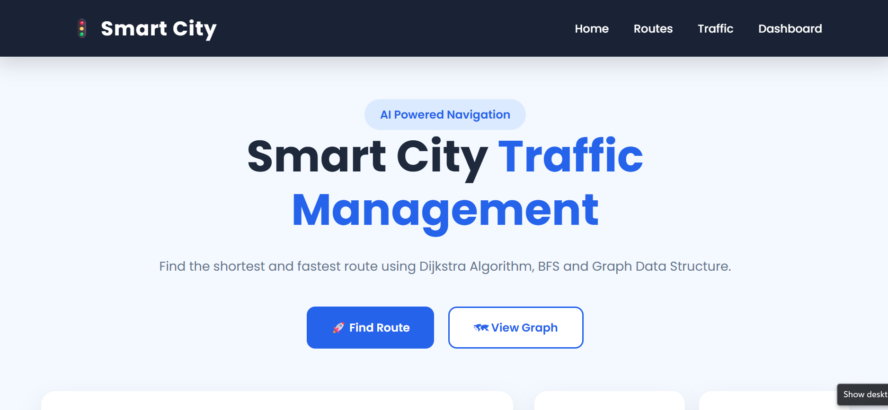
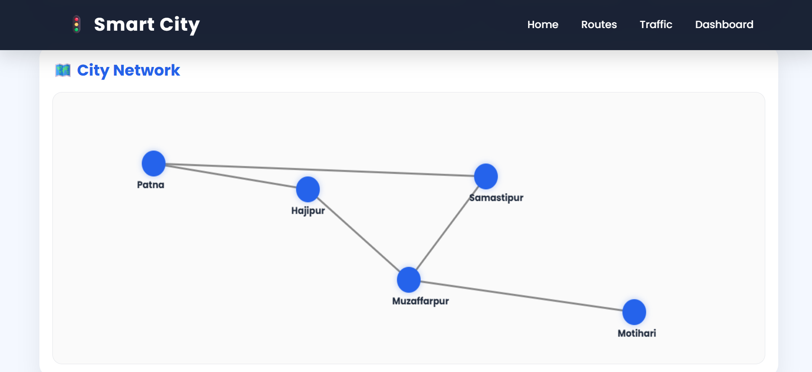
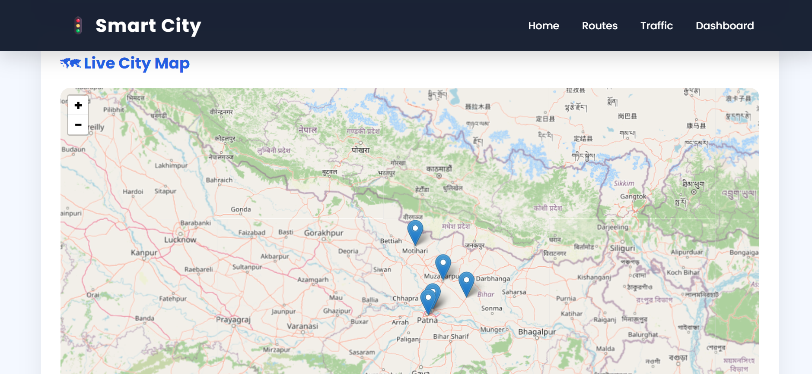
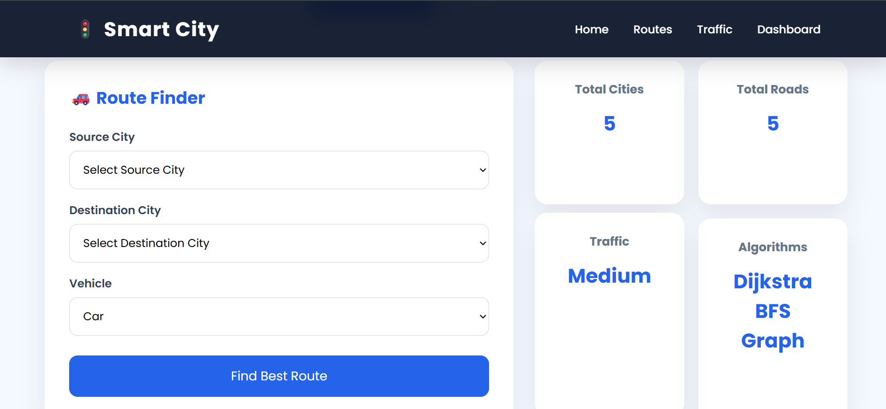
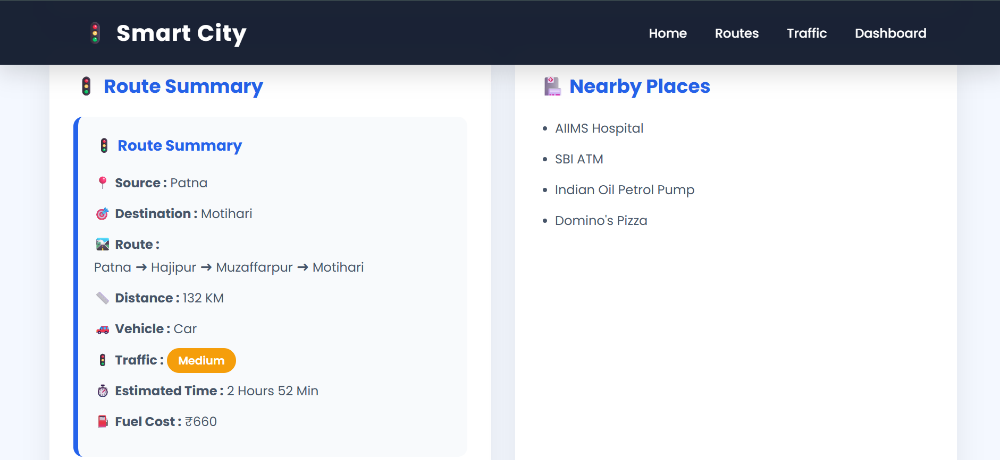

# 🚦 Smart City Traffic Management System


A modern **Smart City Traffic Management System** developed using **Graph Data Structure**, **Dijkstra Algorithm**, **BFS**, **Node.js**, **Express.js**, **HTML**, **CSS**, **JavaScript**, and **Leaflet.js**.

The system helps users find the shortest route between cities, visualize the network on an interactive graph and map, estimate travel time, calculate fuel cost, and explore nearby places.

---

## 🌐 Live Demo

### 🚀 Frontend
https://smart-city-traffic.netlify.app

### ⚙️ Backend API
https://smart-city-traffic-nrhi.onrender.com

### 💻 GitHub Repository
https://github.com/saumyamihir/Smart-City-Traffic

---

# 📸 Project Screenshots

## 🏠 Home Page



---

## 🗺️ City Network Graph



---

## 🌍 Interactive Live Map



---

## 🚦 Route Summary



---

## 📋 Route Details



---

# ✨ Features

- 🚗 Shortest Route Finder
- 🧠 Dijkstra Algorithm
- 🌐 Graph Data Structure
- 🔍 BFS Traversal
- 🗺️ Interactive Leaflet Map
- 📍 Route Highlighting
- 🚦 Traffic Information
- ⏱️ Estimated Travel Time
- ⛽ Fuel Cost Estimation
- 🏥 Nearby Places
- 📱 Responsive User Interface

---

# 🧠 Algorithms Used

## 📌 Graph Data Structure

- Cities are represented as **Nodes**
- Roads are represented as **Weighted Edges**
- Used to build the complete transportation network.

---

## 📌 Dijkstra Algorithm

Used to calculate the shortest route between the selected source and destination cities.

### Workflow

```
Source
   │
   ▼
Graph
   │
   ▼
Dijkstra Algorithm
   │
   ▼
Shortest Route
```

---

## 📌 Breadth First Search (BFS)

Used for graph traversal and connectivity between cities.

Future improvements can use BFS for:

- Nearest city search
- Minimum stop routes
- Emergency vehicle routing

---

# 🛠️ Tech Stack

## Frontend

- HTML5
- CSS3
- JavaScript
- Leaflet.js
- OpenStreetMap

## Backend

- Node.js
- Express.js

## Deployment

- Netlify
- Render

## Version Control

- Git
- GitHub

---

# 📂 Folder Structure

```
Smart-City-Traffic
│
├── client
│   ├── assets
│   ├── css
│   ├── js
│   └── index.html
│
├── server
│   ├── algorithms
│   ├── controllers
│   ├── routes
│   ├── services
│   ├── data
│   └── server.js
│
└── README.md
```

---

# ⚙️ Installation

Clone the repository

```bash
git clone https://github.com/saumyamihir/Smart-City-Traffic.git
```

Move into the project directory

```bash
cd Smart-City-Traffic
```

Install backend dependencies

```bash
cd server
npm install
```

Start the backend server

```bash
npm start
```

Open the frontend using **Live Server**.

---

# 🚦 Route Calculation

The system performs the following steps:

```
User Input
     │
     ▼
Select Source & Destination
     │
     ▼
Graph Construction
     │
     ▼
Dijkstra Algorithm
     │
     ▼
Shortest Route
     │
     ▼
Traffic Analysis
     │
     ▼
Travel Time
Fuel Cost
Nearby Places
Graph Highlight
Map Highlight
```

---

# 🎯 Future Enhancements

- 🤖 AI-based Traffic Prediction
- 📡 Live Traffic API Integration
- 🚑 Emergency Vehicle Routing
- 📍 GPS Navigation
- 🌙 Dark Mode
- 📊 Traffic Analytics Dashboard
- 🔔 Real-time Traffic Alerts

---

# 👨‍💻 Developer

**Saumya Mihir**

GitHub:
https://github.com/saumyamihir

---

# 📄 License

This project is developed for **educational**, **internship**, and **learning** purposes.

---

## ⭐ If you like this project, don't forget to give it a Star on GitHub!
